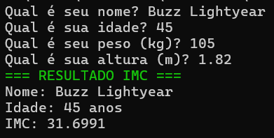
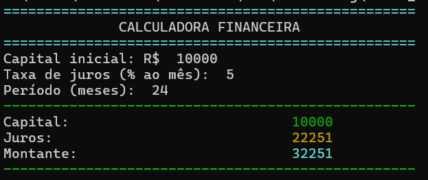
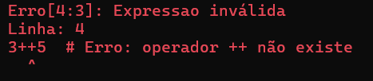

# Rudis - versão 0.2.0

## METADADOS DO PROJETO
- **Nome**: Rudis
- **Versão**: 0.2.0 (Sistema de Erros Avançado + Funções de Entrada de Dados)
- **Filosofia**: Simplicidade, Acessibilidade, Flexibilidade
- **Paradigma**: Interpretada, Dinâmica, Multipropósito
- **Implementação**: C (interpretador)
- **Repositório**: https://github.com/arataca89/rudis
- **Data de Release**: 10/12/2025

---

## RESUMO DAS VERSÕES ANTERIORES

### VERSÃO 0.0.1 (BASE)
- Sistema de tipos: único tipo numérico `double`
- Identificadores: `[a-zA-Z_][a-zA-Z0-9_]*`
- Comentários multi-estilo: `#`, `//`, `/* */`
- Fim de instrução flexível: `\n` e `;`
- Operadores matemáticos: `+`, `-`, `*`, `/`, `%`, `^`, `!` (fatorial pós-fixo)
- Sistema de atribuição encadeada
- 35+ funções built-in (matemáticas, estatísticas, financeiras)
- Sistema de numeração: decimal, hexadecimal (0x), binário (0b)
- REPL interativo com histórico e ajuda básica

### VERSÃO 0.0.2 (SISTEMA DE TIPOS + INTERNACIONALIZAÇÃO)
- ✅ **Sistema de tipos `Value`**: `VAL_NUMBER`, `VAL_STRING`, `VAL_NULL`
- ✅ **Múltiplas instruções**: Suporte a `;` como separador
- ✅ **Internacionalização completa**: PT/EN em todo o sistema
- ✅ **Controle de precisão**: Função `setdec(n)` (0-15 casas)
- ✅ **Comando `reset`**: Limpeza completa de variáveis no ambiente REPL
- ✅ **Correção crítica**: Bug `5/0` (divisão por zero vs. erro de hexa)

### VERSÃO 0.1.0 (SISTEMA DE OUTPUT AVANÇADO + LINHA DE COMANDO)
- ✅ **Operador `+` para concatenação de strings**: Polimorfismo de tipo
- ✅ **34 funções de cores ANSI**: Cores, fundos, estilos
- ✅ **3 funções de alinhamento**: `left()`, `center()`, `right()`
- ✅ **Função `repeat()`**: Criação de separadores
- ✅ **Sistema de linha de comando completo**: REPL, arquivos, one-liners (`-e`)
- ✅ **Sistema de ajuda expandido**: Página 5 para cores
- ✅ **Arquitetura unificada**: Mesma engine para REPL e arquivos

---

## DESIGN DA VERSÃO 0.2.0

### 1. SISTEMA DE ERROS AVANÇADO COM RASTREAMENTO DE LINHA/COLUNA
**Status**: ✅ IMPLEMENTADO COMPLETAMENTE

**Decisão de Design**:
- Rastreamento preciso de linha e coluna para cada token
- Exibição contextual do erro com indicação visual
- Encerramento imediato da execução ao encontrar erro
- Mensagens de erro consistentes em parser e evaluator
- Suporte completo em scripts e REPL

**Melhorias Implementadas**:

#### 1.1 Rastreamento de Posição no Lexer
- **Inicialização**: `line = 1`, `column = 1`
- **Atualização**: Incremento correto ao avançar caracteres
- **Newline**: Incrementa linha, reseta coluna para 1
- **Comentários**: Tratamento correto de `#`, `//`, `/* */` sem perder rastreamento

**Implementação Técnica**:
```c
// lexer.h - Estrutura Token com posição
typedef struct {
    TokenType type;
    double value;
    char text[STR_SIZE];
    char operator;
    int line;      // ← NOVO
    int column;    // ← NOVO
} Token;

// lexer.c - Inicialização
void lexer_init(Lexer* lexer, const char* input) {
    lexer->line = 1;
    lexer->column = 1;
    // ... resto da inicialização
}

// lexer.c - Atualização ao avançar
void lexer_advance(Lexer* lexer) {
    if (lexer->current_char == '\n') {
        lexer->line++;
        lexer->column = 1;
    } else {
        lexer->column++;
    }
    // ... resto do avanço
}
```

#### 1.2 Propagação de Posição no Parser
- **ASTNode**: Campos `line` e `column` para cada nó
- **Criação de nós**: Captura posição do token no momento da criação
- **Funções de criação**: Recebem `int line, int column` como parâmetros

**Implementação Técnica**:
```c
// parser.h - ASTNode com posição
typedef struct ASTNode {
    NodeType type;
    // ... campos de dados ...
    int line;      // ← NOVO
    int column;    // ← NOVO
} ASTNode;

// parser.c - Exemplo de criação de nó
ASTNode* create_number_node(double value, int line, int column) {
    ASTNode* node = (ASTNode*)A89ALLOC(sizeof(ASTNode));
    node->type = NODE_NUMBER;
    node->value = create_number_value(value);
    node->line = line;      // ← Captura posição
    node->column = column;  // ← Captura posição
    return node;
}

// parser.c - Chamada ao criar nó
ASTNode* node = create_number_node(token.value, 
                                   parser->current_token.line,
                                   parser->current_token.column);
```

#### 1.3 Exibição de Erro com Contexto Visual
- **Formato**: `[linha:coluna]: mensagem`
- **Contexto**: Exibe a linha do código com indicador visual
- **Apontador**: Seta (`^`) indicando exatamente onde está o erro

**Exemplo de Saída**:
```
Erro: [5:12]: Expressao inválida
Linha: 5
print(); 3++5
           ^
```

**Implementação Técnica**:
```c
// parser.c - Funções auxiliares
char* get_line_from_file(const char* filename, int line_number) {
    // Extrai uma linha específica do arquivo e a retorna
    // Retorna a linha, ou NULL se não encontrada
    // O chamador é responsável por liberar a memória alocada
}

char* format_error(const char* filename, int line, int column, const char* message) {
    // Formata a mensagem de erro
    // LIBERA A MEMORIA ALOCADA EM get_line_from_file()   
}
```

#### 1.4 Encerramento Imediato da Execução
- **Parser**: Ajusta a flag `has_error` ao encontrar erro
- **Evaluator**: Verifica flag e retorna imediatamente
- **Main**: Encerra programa após erro em script
- **REPL**: Exibe erro e volta ao prompt

**Implementação Técnica**:
```c
// parser.h - Flag de erro
typedef struct {
    Lexer* lexer;
    Token current_token;
    int has_error;           // <== flag de erro
    char error_message[STR_SIZE];
} Parser;

// parser.c - Encerramento ao erro
void parser_set_error(Parser* parser, const char* message) {
    parser->has_error = 1;
    // ... formata mensagem com linha/coluna ...
}

// parser.c - Verificação em parse_statement_list
while (1) {
    if (parser->has_error) {
        .....
        return NULL;  // ← Encerra imediatamente
        .....
    }
    // ... processa statement ...
}
```

#### 1.5 Erros em Funções Built-in
- **Propagação**: Passa `line` e `column` para `execute_function()`
- **Formatação**: Usa `print_error_with_context()` para erros de função
- **Consistência**: Mesmo formato de erro em parser e evaluator

**Implementação Técnica**:
```c
// evaluator.c - Assinatura atualizada
EvaluatorResult execute_function(EvaluatorState* state, 
                                 const char* function_name,
                                 Value* arg_values, int arg_count,
                                 int line, int column) {
    // ... validações ...
    
    // Exemplo: erro em input_string
    if (strcmp(function_name, "input_string") == 0) {
        Value result = input_string(arg_values, arg_count);
        if(result.type == VAL_NULL){
            .....

            return create_error_result(format_error(current_filename, line, column-2, buffer));
        }
        return create_success_result(result, 0); 
    }

// evaluator.c - Chamada com posição
case NODE_FUNCTION:  
    .....
    EvaluatorResult func_result = execute_function(state, node->function,
                                               arg_values, node->arg_count,
                                               node->line, node->column);
    .....
```

---

### 2. FUNÇÕES DE ENTRADA DE DADOS
**Status**: ✅ IMPLEMENTADO COMPLETAMENTE

**Decisão de Design**:
- Duas funções específicas por tipo: `input_string()` e `input_number()`
- Nomes intuitivos indicam claramente o tipo esperado
- Validação robusta com mensagens de erro apropriadas
- Suporte a múltiplos formatos numéricos (decimal, hex, binário, científico)

**Funções Implementadas**:

#### 2.1 input_string(mensagem)
**Descrição**: Lê uma string do usuário com prompt

**Assinatura**:
```c
Value input_string(Value* args, int arg_count)
```

**Parâmetros**:
- `mensagem` (string): Texto exibido como prompt
- Se vazio, exibe mensagem padrão (PT/EN)

**Retorno**: String lida do usuário ou `VAL_NULL` em erro

**Comportamento**:
```python
# Uso básico
nome = input_string("Digite seu nome: ")
print("Olá, " + nome)

# Prompt vazio (usa padrão)
entrada = input_string("")
# Exibe: "Entre com uma string: " (PT) ou "Enter a string: " (EN)

# Validação
# Rejeita entrada vazia
# Retorna null se argumento não for string
```

**Implementação Técnica**:
```c
Value input_string(Value* args, int arg_count){
    Value prompt = args[0];
    if (prompt.type != VAL_STRING) 
        return create_null_value();
    
    // Exibir o prompt
    if(strcmp(prompt.string, ""))
        printf("%s ", prompt.string);
    else{
        if(current_lang == LANG_PT) 
            printf("Entre com uma string: ");
        else
            printf("Enter a string: ");
    }
    fflush(stdout);
    
    // Ler a entrada
    char buffer[STR_SIZE];
    if (fgets(buffer, sizeof(buffer), stdin) == NULL) {
        // Erro ao ler
        return create_null_value();
    }
    
    buffer[strcspn(buffer, "\r\n")] = '\0';

    if (strlen(buffer) == 0) {
        return create_null_value();
    }
    
    // Retornar como Value
    Value result;
    result.type = VAL_STRING;
    strncpy(result.string, buffer, STR_SIZE - 1);
    result.string[STR_SIZE - 1] = '\0'; 
    return result;
}   
```

#### 2.2 input_number(mensagem)
**Descrição**: Lê um número do usuário com validação

**Assinatura**:
```c
Value input_number(Value* args, int arg_count)
```

**Parâmetros**:
- `mensagem` (string): Texto exibido como prompt
- Se vazio, exibe mensagem padrão (PT/EN)

**Retorno**: Número lido ou `VAL_NULL` em erro

**Formatos Suportados**:
- Decimal: `123`, `3.14`, `-42.5`
- Hexadecimal: `0xFF`, `0x1A`
- Binário: `0b1010`, `0B1111`
- Notação científica: `1.5e10`, `2.3E-5`

**Validação**:
- Rejeita múltiplos pontos decimais (ex: `1.2.3`)
- Rejeita caracteres inválidos
- Detecta overflow/underflow
- Detecta NaN e infinito
- Rejeita entrada vazia

**Comportamento**:
```python
# Uso básico
peso = input_number("Digite seu peso: ")
print("Seu peso é: " + peso + " kg")

# Formatos suportados
hex_num = input_number("Número hex: ")      # 0xFF → 255
bin_num = input_number("Número binário: ")  # 0b1010 → 10
sci_num = input_number("Científico: ")      # 1.5e10 → 15000000000

# Validação
# Rejeita: "abc", "1.2.3", "12x34"
# Retorna null se argumento não for string
```

**Implementação Técnica**:
```c
Value input_number(Value* args, int arg_count){

    Value string_input = input_string(args, arg_count);
    double number = 0.0;

    // Se input_string retornou erro
    if (string_input.type == VAL_NULL) {
        return string_input;
    }

    errno = 0;

    // Converte binário (0b)
    if(string_input.string[0] == '0'){
        if(string_input.string[1] == 'b' ||
           string_input.string[1] == 'B') {

            // Verificar se tem pelo menos um dígito binário
            if (string_input.string[2] == '\0') {
                printf("%sErro:%s:%s%s\n", ERROR_COLOR,
                       get_error_invalid_number(), string_input.string, RESET);
                return create_null_value();
            }

            for(int i = 2;string_input.string[i]; i++){
                if (string_input.string[i] == '0' || string_input.string[i] == '1') {
                    int digit = string_input.string[i] - '0';
                    number = number * 2 + digit;

                    // Verifica overflow para binário grande
                    if (number > DBL_MAX || (i > 63 && number > (double)UINT_MAX)) {
                        printf("%sErro:%s%s\n", ERROR_COLOR,
                               get_error_overflow(), RESET);
                        return create_null_value();
                    }
                } else {
                    printf("%sErro:%s:%s%s\n", ERROR_COLOR,
                            get_error_invalid_number(), string_input.string, RESET);
                    return create_null_value();                    
                }
            }
            return create_number_value(number);
        }

    }

    // Converte string para número usando strtod
    // strtod suporta: decimal, hex (0x), notação científica
    char* endptr;
    
    // Primeiro tentar strtod (suporta quase tudo)
    number = strtod(string_input.string, &endptr);

    // Após strtod(), verificar se há caracteres extras
    if (*endptr != '\0') {
        // Se há caracteres extras é erro, número inválido
            printf("%sErro:%s:%s%s\n", ERROR_COLOR,
                    get_error_invalid_number(), string_input.string, RESET);
            return create_null_value();
    }
    
    // Verifica se a conversão foi bem-sucedida
    if (endptr == string_input.string){ 
        printf("%sErro:%s:%s%s\n", ERROR_COLOR,
               get_error_invalid_number(), string_input.string, RESET);
        return create_null_value();
    }
    
    // Verifica overflow/underflow
    if (errno == ERANGE){
        // ERANGE significa overflow ou underflow ocorreu
        if (number == HUGE_VAL || number == -HUGE_VAL) {
            // Overflow: número muito grande
            printf("%sErro:%s%s\n", ERROR_COLOR,
                   get_error_overflow(), RESET);
        } else if (number == 0.0) {
            // Underflow: número muito próximo de zero
            printf("%sErro:%s%s\n", ERROR_COLOR,
                   get_error_underflow(), RESET);
        } else {
            // Outro erro de range
            printf("%sErro:%s%s\n", ERROR_COLOR,
                   "Erro de range numérico", RESET);
        }
        return create_null_value();
    }
    
    // Verificar se resultou em NaN (Not a Number)
    if (isnan(number)){
        printf("%sErro:%s%s:nan\n", ERROR_COLOR,
               get_error_invalid_number(), RESET);
        return create_null_value();
    }
    
    // Verificar se resultou em infinito
    if (isinf(number)){
        printf("%sErro:%s%s:inf\n", ERROR_COLOR,
               get_error_invalid_number(), RESET);
        return create_null_value();
    }
    
    // Retornar o número convertido
    return create_number_value(number);
}
```

#### 2.3 Integração com Evaluator
- **Reconhecimento**: Funções registradas em `is_function()` do lexer
- **Execução**: Chamadas através de `execute_function()` no evaluator
- **Erros**: Propagam com linha/coluna do AST

**Implementação Técnica**:
```c
// lexer.c - Registrar funções
int is_function(const char* text) {
    const char* functions[] = {
        // ... funções existentes ...
        "input_string",  // ← NOVO
        "input_number",  // ← NOVO
    };
    // ... verificação ...
}

// evaluator.c - Executar funções
if (strcmp(function_name, "input_string") == 0) {
    Value result = input_string(arg_values, arg_count);
    if (result.type == VAL_NULL) {
        extern const char* current_filename;
        print_error_with_context(current_filename, line, column,
            "Argumento da função input_string() deve ser uma string");
    }
    return create_success_result(result, 0);
}

if (strcmp(function_name, "input_number") == 0) {
    Value result = input_number(arg_values, arg_count);
    if (result.type == VAL_NULL) {
        extern const char* current_filename;
        print_error_with_context(current_filename, line, column,
            "Argumento da função input_number() deve ser uma string");
    }
    return create_success_result(result, 0);
}
```

---

## EXEMPLOS COMPLETOS DA VERSÃO 0.2.0:

### EXEMPLO 1: PROGRAMA INTERATIVO COM ENTRADA E ERRO TRATADO
```python
# Solicita dados do usuário
nome = input_string("Qual é seu nome?")
idade = input_number("Qual é sua idade?")
peso = input_number("Qual é seu peso (kg)?")

# Calcula IMC
altura = input_number("Qual é sua altura (m)?")
imc = peso / (altura * altura)

# Exibe resultado formatado
setdec(2)
print(bold(green("=== RESULTADO IMC ===")))
print("Nome: " + nome)
print("Idade: " + idade + " anos")
print("IMC: " + imc)

/* NO FUTURO
if imc < 18.5
    print(yellow("Classificação: Abaixo do peso"))
else if imc < 25
    print(green("Classificação: Peso normal"))
else if imc < 30
    print(yellow("Classificação: Sobrepeso"))
else
    print(red("Classificação: Obeso"))
*/
```

SAÍDA:



### EXEMPLO 2: CÁLCULO FINANCEIRO COM ENTRADA
```python
# Entrada de dados
setdec(2)
print(bold(cyan(repeat("=", 50))))
print(center(50, "CALCULADORA FINANCEIRA"))
print(bold(cyan(repeat("=", 50))))

capital = input_number("Capital inicial: R$ ")
taxa = input_number("Taxa de juros (% ao mês): ")
meses = input_number("Período (meses): ")

# Cálculo de juros compostos
montante = capital * ((1 + taxa/100) ^ meses)
juros = montante - capital

# Exibição
print(bold(green(repeat("-", 50))))
print("Capital:  " + right(30, green(capital)))
print("Juros:    " + right(30, yellow(juros)))
print("Montante: " + right(30, bold(cyan(montante))))
print(bold(green(repeat("-", 50))))
```

SAÍDA:



### EXEMPLO 3: TRATAMENTO DE ERRO COM LINHA/COLUNA
**Script com erro**:
```python
nome = input_string("Nome: ")
idade = input_number("Idade: ")
print("Olá, " + nome + "!")
3++5  # Erro: operador ++ não existe
print("Fim")
```

Saída:



---

## OBSERVAÇÕES TÉCNICAS

### 1. RASTREAMENTO DE LINHA/COLUNA
- **Lexer**: Atualiza `line` e `column` a cada caractere
- **Comentários**: Tratamento correto sem perder rastreamento
- **Newline**: Incrementa linha, reseta coluna
- **Performance**: Mínimo overhead (apenas incrementos)

### 2. PROPAGAÇÃO DE ERROS
- **Parser**: Detecta e armazena erro com posição
- **Evaluator**: Propaga erro do parser ou gera novo com posição
- **Main**: Exibe erro com contexto visual
- **Encerramento**: Imediato em script, volta ao prompt em REPL

### 3. FUNÇÕES DE ENTRADA
- **Reutilização**: `input_number()` usa `input_string()` internamente
- **Validação**: Robusta com detecção de múltiplos erros
- **Internacionalização**: Mensagens em PT/EN
- **Flexibilidade**: Suporta múltiplos formatos numéricos

### 4. INTEGRAÇÃO COM SISTEMA EXISTENTE
- **Compatibilidade**: 100% com v0.1.0
- **Padrão**: Segue mesmo padrão de funções built-in
- **Extensibilidade**: Base pronta para mais funções de entrada

### 5. EXPERIÊNCIA DO USUÁRIO
- **Clareza**: Mensagens de erro precisas com localização exata
- **Contexto**: Exibição visual do erro facilita correção
- **Robustez**: Validação completa de entrada
- **Produtividade**: Funções intuitivas e fáceis de usar

---

## ✅ **ESTADO ATUAL DO PROJETO**

**Progresso da v0.2.0**: 100% completo
- ✅ **Rastreamento de linha/coluna** - Lexer e Parser
- ✅ **Propagação de posição** - AST com line/column
- ✅ **Exibição contextual** - Erro com indicador visual
- ✅ **Encerramento imediato** - Parada em primeiro erro
- ✅ **input_string()** - Leitura de strings com validação
- ✅ **input_number()** - Leitura de números com múltiplos formatos
- ✅ **Integração completa** - Erros em parser e evaluator

**Compatibilidade com v0.1.0**: 100% mantida

**Compatibilidade com v0.0.2**: 100% mantida

**Compatibilidade com v0.0.1**: 100% mantida

---

## 🎯 VERSÕES FUTURAS (PREVIEW):

### **v0.3.0** 
- **Estrutura de controle** - `if-else`


### **v0.4.0** 
- **Estrutura de laço** - `loop`


### Implementações futuras(algumas ideias)

- **Estrutura de casamento de padrões** - `match`
- **Operações com strings** - Comparação, extração, substituição
- **Expressões regulares básicas** - Busca e substituição
- **Funções string avançadas** - `split()`, `join()`, `trim()`
- **Funções definidas pelo usuário** - `function nome() ... end`
- **Escopo de variáveis** - Locais vs. globais
- **Arrays/Listas** - Estrutura de dados para múltiplos valores
- **Operações em arrays** - Iteração, filtro, mapeamento
- **Funções de array** - `length()`, `append()`, `remove()`

---

**Última atualização**: 10/12/2025  
**Status da versão**: ✅ PRONTA PARA RELEASE  
**Nota Técnica**: O Rudis agora possui um sistema robusto de tratamento de erros com rastreamento preciso de linha/coluna, facilitando a depuração de scripts. As funções de entrada de dados permitem criar programas interativos completos. A base estabelecida é sólida para expansão com estruturas de controle na próxima versão.

